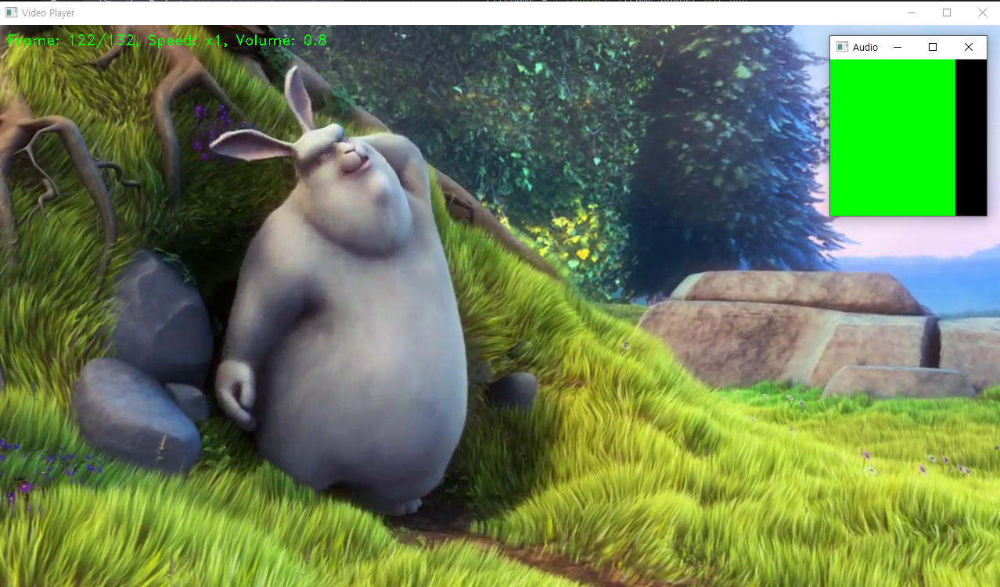
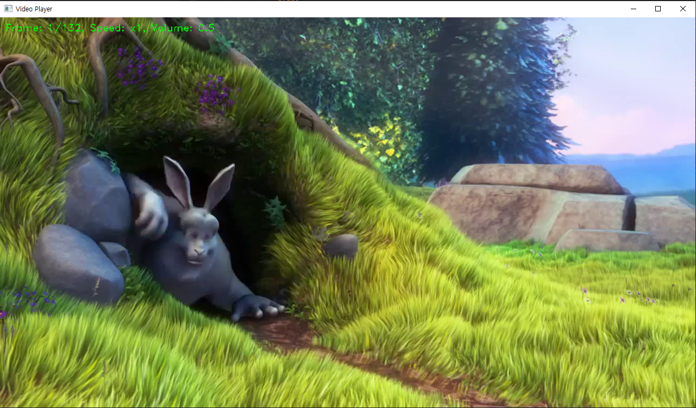
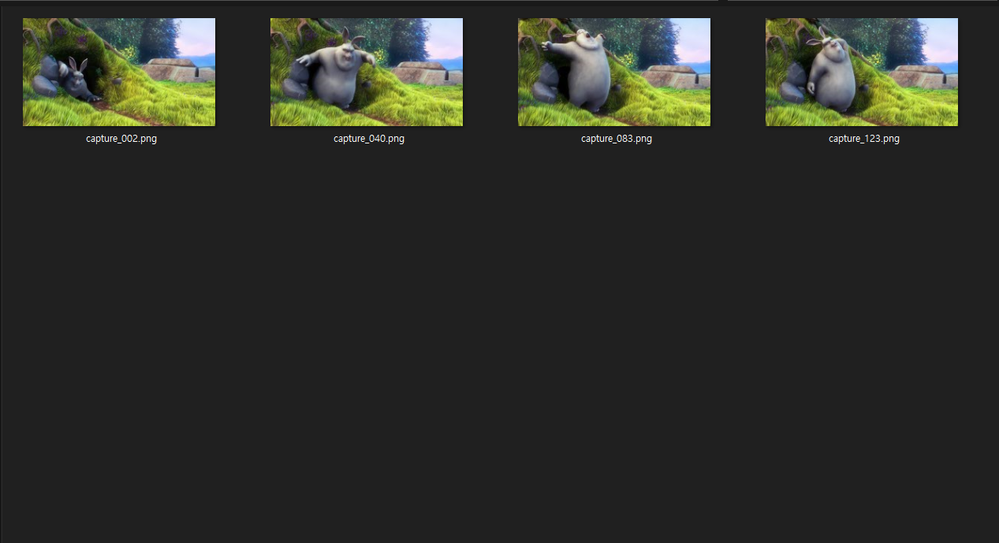
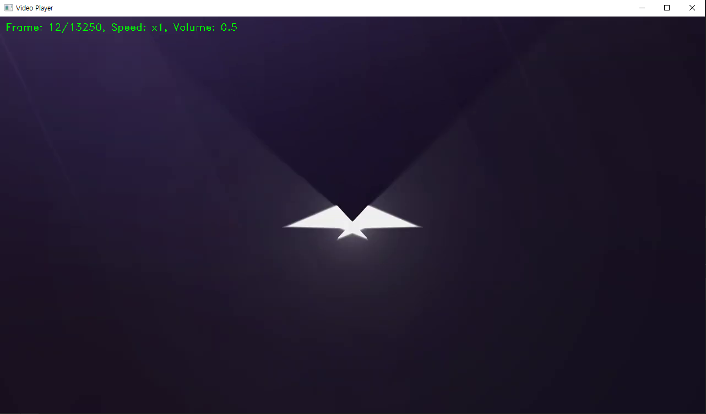

# Video Player
This is a simple video player program that allows you to **play local video files or videos from URLs.** It has basic playback controls, such as play/pause, speed adjustment, and volume control. It also has a **screen capture** function to capture frames from the video. You can also streaming youtube, it will download and play the video

---
## Screenshots

* volume control

* capture frame

* saved directory

* youtube streaming(download)

---
## Requirements
* Python 3.x
* OpenCV (pip install opencv-python)
* NumPy (pip install numpy)
* pytube (pip install pytube)

---
## How to use
1. Clone the repository or download the videoPlayer.py file.
1. Open a terminal and navigate to the directory containing the videoPlayer.py file.
1. Run the program with python videoPlayer.py.
1. When prompted, enter the path to the local video file or the URL of the video you want to play.
1. Use the following controls to operate the video player:
   * Space : play/pause
   * Tab : reset playback speed to 1x
   * \> or . : increase playback speed
   * < or , : decrease playback speed
   * ] or } : skip 10 frames forward
   * \[ or { : skip 10 frames backward
   * = : increase volume
   * \- : decrease volume
   * s : capture screen
   * Esc : exit the program
1. If you press s to capture the screen, the captured frame will be saved to a file named capture_001.png, capture_002.png, and so on.

---
## Notes
* If the video file is a URL, the program will download the video file and save it to a temporary file before playing it.
* If you encounter any errors or issues while using the program, please feel free to open an issue in the repository.
